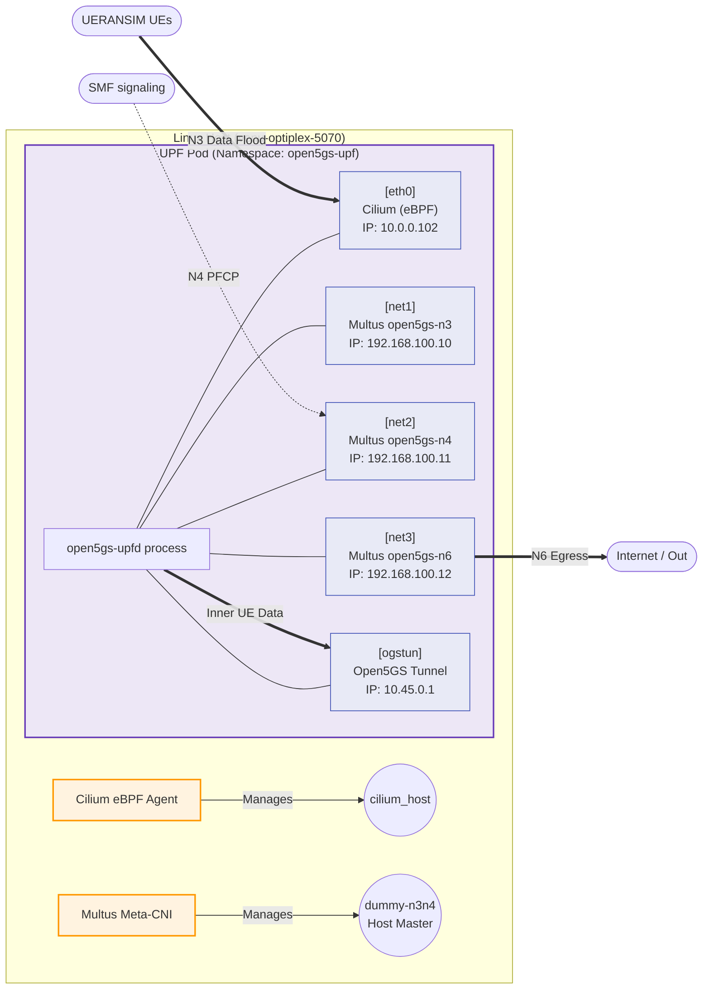

# 5G Deployment Architecture: Visual Breakdown

To truly understand how this testbed is structured, we need to look at it from two perspectives: the **Logical Architecture** (how the 5G components talk to each other) and the **Network Topology** (how Multus and Cilium wire those components together).

---

## 1. Logical Architecture: Control Plane / User Plane Separation (CUPS)

The entire goal of this deployment was to isolate the Control Plane (signaling) from the User Plane (heavy data traffic). We achieved this by splitting them into two different Kubernetes namespaces, simulating two different physical clusters/locations.

```mermaid
flowchart TD
    subgraph Control Plane Namespace ["Namespace: open5gs (Control Plane & Radio)"]
        direction TB
        AMF[AMF (Mobility)]
        NRF[NRF (Registry)]
        UDM[UDM (Database)]
        SMF[SMF (Session Management)]
        UEbsp[UERANSIM (UEs & gNB)]
        
        AMF <--> NRF
        SMF <--> NRF
        UDM <--> NRF
        UEbsp <--> AMF
    end

    subgraph User Plane Namespace ["Namespace: open5gs-upf (User Plane)"]
        direction TB
        UPF[UPF (Data Gateway)]
    end

    %% Cross-Namespace Connections
    SMF <==>|N4 Interface (PFCP Signaling)| UPF
    UEbsp <==>|N3 Interface (GTP-U Tunnels)| UPF
    UPF ==>|N6 Interface (Egress Data)| Internet((Internet))

    classDef cp fill:#e1f5fe,stroke:#03a9f4,stroke-width:2px;
    classDef up fill:#fce4ec,stroke:#e91e63,stroke-width:2px;
    classDef inet fill:#f1f8e9,stroke:#8bc34a,stroke-width:2px;
    
    class AMF,NRF,UDM,SMF,UEbsp cp;
    class UPF up;
    class Internet inet;
```

---

## 2. Network Topology: How Multus & Cilium Wire the UPF

The **UPF (User Plane Function)** is the heavy lifter. If it only had one network cable, all the N3 data floods, N4 signaling, and N6 internet traffic would collide on the same wire. 

Here is how **Multus** (giving the pod multiple wires) and **Cilium** (making the first wire extremely fast using eBPF) work together inside the UPF Pod.



### Visual Summary

1. **How they attach:** 
   * `eth0` is created by **Cilium**. This is the default Kubernetes network where standard cluster traffic flows. We hijacked this highly-optimized eBPF lane to carry the massive **N3 Data Plane** flood from UERANSIM.
   * `net1`, `net2`, `net3` are created by **Multus**. Multus connects these virtual MACVLAN interfaces to the parent `dummy-n3n4` interface on the Linux host machine.
2. **How they are used:** 
   * **`eth0` (Cilium):** Handles the massive 20-UE `iperf3` data blasts (N3). Because Cilium uses eBPF, the UPF CPU utilization stays near 0%.
   * **`net2` (Multus N4):** The SMF reaches across the namespace divide and targets this strict 192.168.100.x subnet to send PFCP control instructions to the UPF.
   * **`ogstun`:** When GTP-U packets arrive on `eth0`, the UPF strips the headers and routes the raw UE packets out through this virtual tunnel.
   * **`net3` (Multus N6):** Used for egress routing (the path the UE traffic takes to leave the local network and hit the internet).
